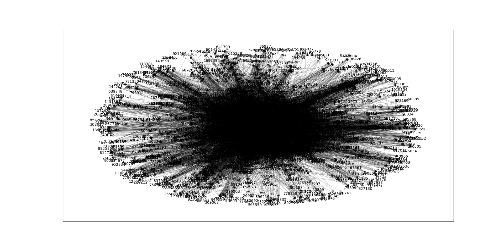

# MCMICM-Python

this model aim at rank the influence of those musician. 

Our model is designed to solve the problem of the influence of different musicians, some of whom are clearly influenced by other musicians, and our goal is to use the algorithm to find these musicians.
Our idea mainly refers to the algorithm of Google Matrix, that is, if a musician influences another musician who influences many musicians, we believe that the musician can be equivalent to an "ancestor" node, and he should also have a high influence.
We increase this iteration empirically to three times, meaning that no musician can influence the next three generations of musicians, nor does he get any coefficient improvement from this link

you can see our matrix in googleMatrix3.csv, it show the influce between every musician.

In addition, we use Topsis algorithm to rank the influence of each musician and select the most influential musician

